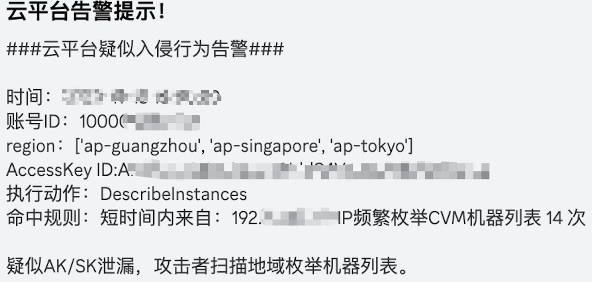
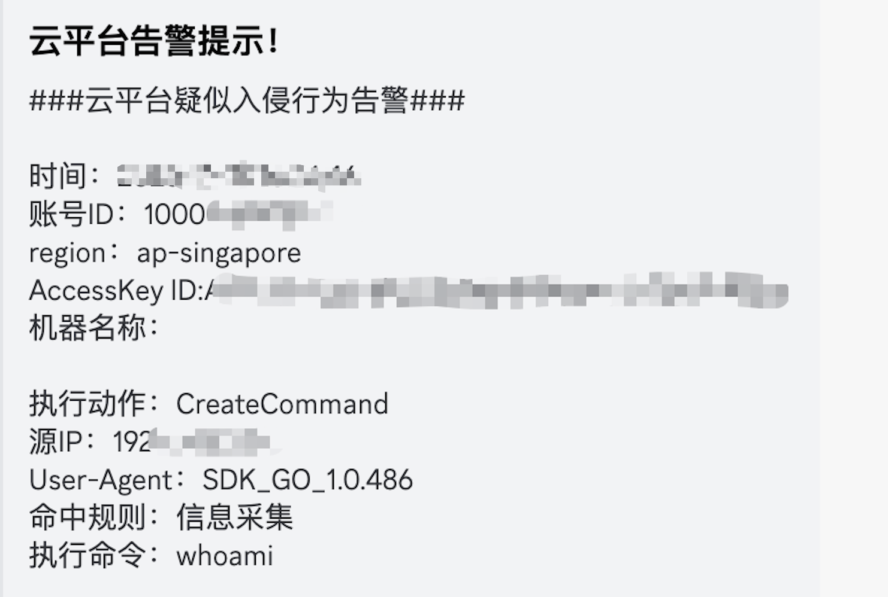
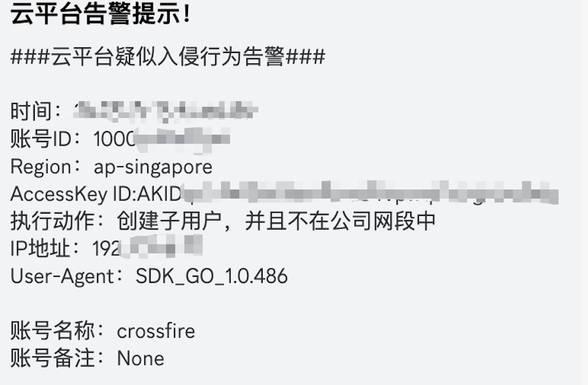

## 项目简介

cloud-audit （云安全审计助手）是检测公有云厂商AK/SK泄漏被利用的工具，通过定期调用云平台接口审计日志，基于异常行为/黑特征/基线发现疑似入侵行为。

当前仅支持腾讯云与AWS

## 特性

- 支持检测腾讯云平台AK/SK利用告警（异常行为）
    - 调用AK/SK创建命令/执行命令监控
    - 调用AK/SK添加子账户/删除子账户监控
    - 调用AK/SK跨region列DB
    - 调用AK/SK跨region列实例
- 支持检测AWS云平台AK/SK利用告警（基线检测）
    - 调用AK/SK创建用户监控
    - 调用AK/SK列用户监控
    - 调用AK/SK列S3监控
    - 调用AK/SK列DB监控
    - 调用AK/SK提权监控
- 支持企业微信/Discord 告警通知

## 使用说明

第一步：执行命令安装依赖

```bash
cd /opt/ && git clone https://github.com/al0ne/cloud-audit
cd cloud-audit && pip3 install -r requirements.txt
```

第二步：创建并修改.env配置

```bash
cp .env.example .env
```

根据自己的实际配置填入.env文件

```bash
# 腾讯云的AK/SK信息，需要使用AK/SK来调用API接口获取日志
TencentAccessKey="xxx"
TencentSecretKey="xxx"

# 腾讯云要监控的AK/SK列表
AccesskeyList="xxx,xxx,xxx"

# AWS的AK/SK信息
AWS_ACCESS_KEY_ID="xxx"
AWS_SECRET_ACCESS_KEY="xxx"

# Discord 通知信息
discord_webhook_url=""

# 企业微信机器人通知
weixin_webhook_url=""
```

第三步：程序重要配置

```bash
# 可信的网段，非可信网段调用敏感操作直接告警。
while_cidr = ["192.168.0.0/16", "172.16.0.0/12", "10.0.0.0/8"]

# AWS要关注的地域，非该地域的事件将不查询
aws_region = [
    "us-east-1",
    "us-east-2",
    "ap-northeast-1",
    "ap-southeast-1"
]
```

运行

```bash
python3 cloud-audit.py
```

程序每隔15分钟执行一次搜索结果

### AWS 权限问题说明

由于AWS日志是使用的AWS CloudTrail服务来读取并审计日志的，请一定确保你的账号的IAM权限要有**AWSCloudTrail_ReadOnlyAccess**才能使用本产品，否则会有以下报错信息。

```
botocore.exceptions.ClientError: An error occurred (AccessDeniedException) when calling the LookupEvents operation: User: arn:aws:iam::xxxxx:user/test is not authorized to perform: cloudtrail:LookupEvents because no identity-based policy allows the cloudtrail:LookupEvents action
```

进入AWS IAM平台，选择用户--》权限处来添加权限

## 检测逻辑

### 云平台利用检测逻辑

在使用一些针对云平台利用工具时，这类工具通常的动作会包括扫描所有region下是否存在RDS实例，所有region下是否存在ECS实例或者容器等，创建/删除子账号，执行命令等。这些动作本身就属于比较敏感的操作，所以通过各个云平台的日志接口来获取这些动作。

还有一种则是根据来自非可信网段的敏感操作，正常都是IDC内网调用或者IDC出口IP调用，如果非企业可信网段出现AK/SK调用并且为高危操作则直接告警。

常见比较敏感的关键操作例如：

- CreateUser
- ListUsers
- ListBuckets
- DescribeInstances
- DescribeDBInstances
- AttachUserPolicy
- RunCommand/CreateCommand（腾讯云）

### 腾讯云检测

腾讯云与AWS API调用最大的不同在于，腾讯云可以通过API接口查询某个AK id的详细动作，但是AWS只能在平台上搜索，而不能通过AK/SK调用接口查询某个AK id的最近的执行信息

所以要检测腾讯云AK/SK的利用，就需要输入要监控线上业务使用的AK id列表，定期查看某个AK id执行的动作

### AWS 检测

AWS则只能根据region和动作来获取日志，通过AK/SK调用CloudTrail接口获取某个region下某个动作是否有日志

所以AWS更多是根据基线来判断的

```python
def DescribeInstances(CloudTrailEvent: dict):
    """
    检测使用AK/SK列ec2信息
    :param CloudTrailEvent:
    :return: None
    """
    accessKeyId = CloudTrailEvent.get('userIdentity').get('accessKeyId')
    arn = CloudTrailEvent.get('userIdentity').get('arn')
    eventTime = utc_to_china_tz(CloudTrailEvent.get('eventTime'))
    eventName = CloudTrailEvent.get('eventName')
    awsRegion = CloudTrailEvent.get('awsRegion')
    sourceIPAddress = CloudTrailEvent.get('sourceIPAddress')
    userAgent = CloudTrailEvent.get('userAgent')

    sip_verify = False

    for cidr in while_cidr:
        if ipaddress.ip_address(sourceIPAddress) in ipaddress.ip_network(cidr):
            sip_verify = True

    if not sip_verify and 'aws-internal' not in userAgent:
        message = f"{text_title}\n时间：{eventTime}\n账号ID：{arn}\nRegion：{awsRegion}\nAccessKey ID:{accessKeyId}\n"
        f"执行动作：{eventName}\nIP地址：{sourceIPAddress}\nUser-Agent：{userAgent}\n\n"
        f"检测到有外部IP请求列实例信息，请注意是否为攻击者利用！"
    send_message(message)
```

## 运行截图

Discord 告警截屏







## 未来规划

目前仅根据行为去检测，实际还可以根据基线去检测。

- 非SDK的UA去AK/SK调用
- 基线检测，历史未执行过相关命令初次执行则直接告警